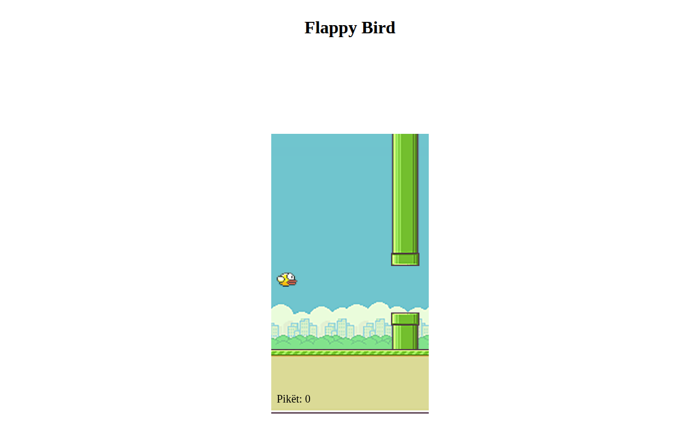

# Flappy Bird 🐤

Një lojë klasike Flappy Bird në HTML5/JavaScript, e përshtatur në gjuhën shqipe.



## Përshkrimi

Fluturo mes tubave dhe grumbullo sa më shumë pikë! Loja përdor mekanikën origjinale të Flappy Bird: graviteti tërheq zogun poshtë, dhe çdo shtypje tasti e ngre atë lart. Çdo tub që kalon rrit pikët.

## Si luhet

1. Hapni [Demo live](https://erionnezha.github.io/Flappy-Bird-Game/).
2. Shtypni një tast (p.sh. hapësirën) për të fluturuar lart.
3. Shmangni tubat — çdo përplasje rifillon lojën.
4. Çdo tub i kaluar = 1 pikë.

## Teknologjitë

- HTML5 Canvas
- CSS3
- JavaScript (pa framework-e)

## Struktura

```
index.html      → faqja kryesore (shqip)
flappyBird.js   → logjika e lojës
style.css       → stili
images/         → sprite-at e lojës (zogu, tubat, sfondi)
sounds/         → tingujt (fluturim, pikë)
```

## Autori & burimi

- **Përshtatja në shqip:** Erion Nezha
- Loja është një version i edukativ i lojës klasike Flappy Bird.

## Licenca

MIT — shiko [LICENSE](LICENSE).

---

# Flappy Bird 🐤

A classic Flappy Bird game in HTML5/JavaScript, localized in Albanian.

## Description

Fly between the pipes and collect as many points as possible! The game uses the original Flappy Bird mechanics: gravity pulls the bird down, and each key press lifts it up. Every pipe you pass increases the score.

## How to play

1. Open the [Live demo](https://erionnezha.github.io/Flappy-Bird-Game/).
2. Press any key (e.g. spacebar) to fly up.
3. Avoid the pipes — any collision restarts the game.
4. Each pipe passed = 1 point.

## Technologies

- HTML5 Canvas
- CSS3
- JavaScript (no frameworks)

## Localization note

- **Albanian localization:** Erion Nezha
- This is an educational version of the classic Flappy Bird game.

## License

MIT — see [LICENSE](LICENSE).
